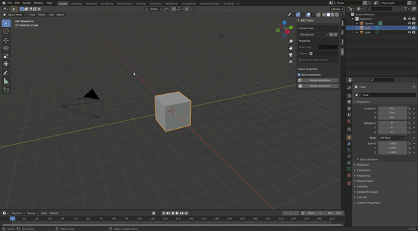

# Blender Annotation Tool (BAT)

A blender addon for 3D scene annotation.

## Installation

The addon requires Blender version 2.8+ and was tested with Blender 2.9.3.

To install the addon download the repository as a zip file. In Blender navigate to Edit>Preferences>Addons and click Install.
Select the downloaded zip. After this the addon should appear in the list of addons (in the Render category). Click the checkbox to activate the addon.

**IMPORTANT: Upon installation, after the addon is activated first click inside the 3D viewport to trigger an update. This sets a default value for the list of classes. Othervise the addon will still be functional, but the 'Background' class will be missin which might be confusing.**

After installation the addon can be used in the Layout tab's N menu.

## Usage

Use the panel to add, delete and edit classes. If 'save annotations' is checked, teh annotations will be saved in a file whenever the annotations are rendered or a render from the scene is saved.

The **render annotation** button can be used to view the annotation result for the current scene and frame.

The **render animation** button is a convenience functionality, as the automatic saving of annotations does not work with Blender's original Render Annotation button. Keep in mind that **BAT's render animation button is blocking** so the UI will not respond until the whole animation is rendered. This is necessary for the saving of the annotations along with the renders.

The naming scheme fo the annotations is RENDERED_FRAME_annotation.extension, where RENDERED_FRAME is the filename for the rendered frame and extension is the extension set in the output properties in Blender. The annotations are saved in the same directory as the renders.

### Simple usage example

### Instance segmentation example

