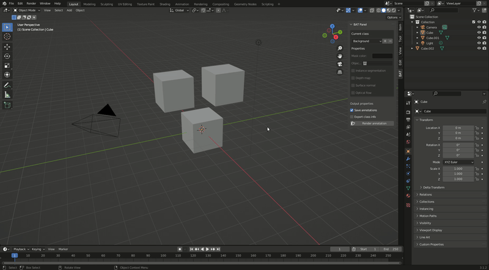
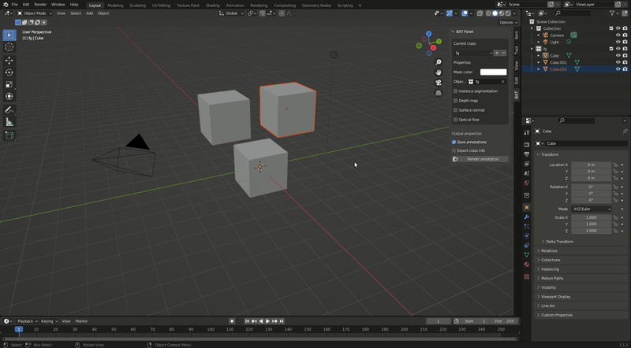

# Blender Annotation Tool (BAT)

A blender addon for 3D scene annotation.

## Installation

The addon requires Blender version 3.1.2 (It might work with a newer Blender version as well)

To install the add-on, download the repository as a zip file. Then, in Blender, navigate to Edit>Preferences> Addons and click Install.
Select the downloaded zip. The addon should then appear in the list of addons (in the Render category). Click the checkbox to activate the addon.

**IMPORTANT: Upon installation, after the addon is activated, click inside the 3D viewport to trigger an update. This sets a default value for the list of classes. Otherwise, the addon will still be functional, but the 'Background' class will be missing, which might be confusing.**

After installation, the addon can be used in the Layout tab's N menu.

## Usage

Use the panel to add, delete, and edit classes. You can select which class you want to configure using the current class dropdown selector. All configured classes will be represented in the annotations. Choosing a mask color is only necessary for visualization purposes (the saved file will have class and instance ID channels included). The `Instance segmentation` checkbox can be used to distinguish between instances of this class. The `Depth map`, `Surface normal`, and `Optical flow` checkboxes can be used to generate the corresponding modalities along with the annotations (these checkboxes are shared across all classes).

If `Save annotations` is checked, the annotations will be saved in a file whenever they are rendered. If `Export class info` is checked, a JSON object containing the mapping between class IDs and class names will be saved upon rendering.

The **render annotation** button allows you to manually render the annotations for the current scene and frame.

The annotations are saved as OpenEXR Multilayer files in a newly created folder called `annotations` in the same directory as the renders. You can use the `OpenEXRReader` class in [this repository](https://github.com/karolyartur/exr_reader) to read these files into Python efficiently.

### Simple usage example with binary segmentation

### Instance segmentation and additional modalities

